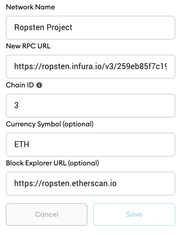

# Crypto Sneaker

Project for IOT faculty on AGH university.

## About

Project ships with a smart contract implementation and dapp (distributed application).

## Setup

You will need to install MetaMask extension in your browser and create an account.

Currently smart contract is deployed on ropsten development network.

**Current contract address**: 0xA36e2A7b0B1CDd13213d661Fb755a5Ca5e6e99D0

**Current network URL**: https://ropsten.infura.io/v3/259eb85f7c194bb0b034617be10aa764

### Setup metamask network to look as following one:
 

 

**To interact with a network you will need some ether.**

You can get 1 ETH by requesting it on [this website](https://faucet.ropsten.be/).

## Application
Application is available at given address: 

